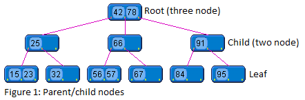
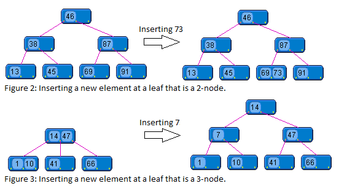
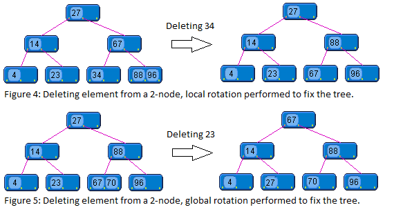
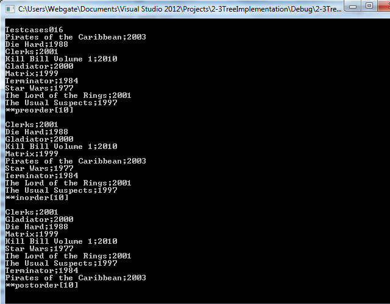

# 2-3 Tree Implementation in C++

# Table of Contents

- [Introduction](#introduction)
- [Background](#background)
  - [Inserting Elements into a 2-3 Tree](#inserting-elements-into-a-2-3-tree)
    - [Empty Tree](#empty-tree)
    - [Inserting into a 2-Node Leaf](#inserting-into-a-2-node-leaf)
    - [Inserting into a 3-Node Leaf](#inserting-into-a-3-node-leaf)
  - [Deleting Elements from a 2-3 Tree](#deleting-elements-from-a-2-3-tree)
    - [Removing from a Leaf 3-Node](#removing-from-a-leaf-3-node)
    - [Removing from a Leaf 2-Node](#removing-from-a-leaf-2-node)
    - [Removing from an Internal Node](#removing-from-an-internal-node)
- [Using the Code](#using-the-code)
  - [Creating a Tree Object](#to-create-a-tree-object-call-the-default-constructor)
  - [Operator Overloads](#in-order-for-the-ctree-object-to-make-the-necessary-key-comparisons)
  - [Overview of Public CTree Functions](#overview-of-public-ctree-functions)
- [Output from the Test Project](#output-from-the-test-project)
- [Points of Interest](#points-of-interest)
- [References](#references)

# Introduction

This C++ application demonstrates the functionality of a 2-3 tree data structure. It supports dynamic insertion and deletion of elements, providing a clear illustration of balanced tree operations and node restructuring in real time. The implementation is based on several articles found on the internet. These articles can be found in the references section, which also offers articles with an in-depth explanation of a 2-3 tree.

For the implementation I used a threaded tree. A threaded tree makes use of a parent pointer. This parent pointer makes it easier to move from a child node to its corresponding parent without using recursion. In addition, I used templates to enable the usage of different data types in the 2-3 tree.

# Background

A 2-3 tree is a multi-way search tree in which each node has two children (referred to as a two node) or three children (referred to as a three node). A two node contains one element. The left subtree contains elements that are less than the node element. The right subtree contains elements that are greater than the node element. However, unlike a binary search tree, a two node can have either no children or two children; it cannot have just one child. A three node contains two elements, one designated as the smaller element and one designated as the larger element. A three node has either no children or three children. If a three node has children, the left subtree contains elements that are less than the smaller node element. The right subtree contains elements that are greater than the larger node element. The middle subtree contains elements that are greater than the smaller node element and less than the larger node element. Due to the self-balancing effect of a 2-3 tree, all the leaves are on the same level. A 2-3 tree of size N has a search time complexity of O(log N).



## Inserting Elements into a 2-3 Tree

All insertions in a 2-3 tree occur at the leaves of the tree. The tree is searched to determine where the new element will go, then it is inserted. The process of inserting an element into a 2-3 tree can have a ripple effect on the structure of the rest of the tree. Inserting an element into a 2-3 tree can be divided into three cases:

### Empty Tree

The simplest case is that the tree is empty. In this case, a new node is created containing the new element. The node is then designated as the root of the tree.

### Inserting into a 2-Node Leaf

The second case occurs when we want to insert a new element at a leaf that is a 2-node. In this case, the new element is added to the 2-node, making it a 3-node.

### Inserting into a 3-Node Leaf

The third insertion situation occurs when we want to insert a new element at a leaf that is a 3-node. In this case, the 3-node is split and the middle element is moved up a level in the tree, and the insertion process is repeated. When the root of the tree is split, the height of the tree increases by one.  



## Deleting elements from a 2-3 tree

Deleting elements from a 2-3 tree is also made up of three cases:

### Removing from a Leaf 3-Node

The simplest case is that the element to be removed is in a leaf that is a 3-node. In this case, removal is simply a matter of removing the element from the node.

### Removing from a Leaf 2-Node

The second case is that the element to be removed is in a leaf that is a 2-node. This condition is called underflow and creates a situation in which we must rotate or merge nodes in order to maintain the properties of the 2-3 tree.

### Removing from an Internal Node

The third case is that the element to be removed is in an internal node. In this case, we can simply replace the element to be removed with its inorder successor. The inorder successor of an internal element will always be a leaf element. After replacement we can simply remove the leaf element using the first or second case.



# Using the code

The code is ready to use. The test cases are described in the document TreeTestcases.pdf, which can be found [here](assets/files/TreeTestCases.pdf). The CTree class is used to create a tree object. The << and >> operators are used in the CTree class.

All tree functions are encapsulated in two template classes: CTree and CNode. Each tree function has a comment block describing its functionality. The implementation avoids recursion to prevent stack overflow, using loops instead. The print function is more complicated due to this approach.

### To create a tree object, call the default constructor.

```cpp
CTree<CMovie> *pMovieTree = new CTree<CMovie>();
```

In order for the CTree object to make the necessary key comparisons, the key object must implement the < operator.

```cpp
class CMovie
{
    inline bool operator< (const CMovie& rCMovie) const
    {
        return (strcmp(this->getTitle(), rCMovie.getTitle()) < 0);
    }
};

int CTree<T>::TCompare(const T* const pT1, const T* const pT2) const
{
    int iReturnCode = FAILURE;
    if (*pT1 < *pT2)
    {
        iReturnCode = LESS;
    }
    else if (*pT2 < *pT1)
    {
        iReturnCode = GREATER;
    }
    else
    {
        iReturnCode = EQUAL;
    }
    return iReturnCode;
}
```

In order for the CTree object to print the key objects, the key object must also implement the << operator.

```cpp
// Overload the output stream operator for CMovie
friend std::ostream& operator<<(std::ostream& out, CMovie& rCMovie)
{
    out << rCMovie.getTitle() << ":" << rCMovie.getReleaseYear();
    return out;
}
```

## Overview of public CTree functions

```cpp
//Inserts a new key in the tree.
int insert(const T* const pKey)

//Deletes a key and fixes the tree.
int deleteItem(const T* const pKey)

//Searches for a specified key in the tree.
const T* const find(const T* const)

//Prints all keys (inorder, postorder, and preorder).
int print(eTreeTraversal eTraversalMethod) const

//Removes all tree nodes.
int removeAll(void)
```

# Output from the test project

The sample project demonstrates various method calls to the tree. The resulting output is shown in a console window. Executing one of the test cases produces the following output:



# Points of Interest

Tree structures are designed to store key objects. These key objects may contain key attributes used for comparison and data attributes. To search for a specific object in the tree, a search object is created with the comparison attributes set. This object is passed to a method that searches the tree and returns the result.

Examples of tree searches can be found in the demo project.

Templates used in tree classes are implemented in header files. Boolean flags are used to indicate which keys are set due to the usage of template variables.

```cpp
T m_tSmallKey;
T m_tBigKey;
bool m_bBigKeyIsSet;
bool m_bSmallKeyIsSet;
```

The code is well tested. A summary of the test cases used can be found in the included document TreeTestcases.pdf. Improvements that can be made to the code include:

1. Displaying the tree in a graphical format instead of a Windows console
2. Optimizing the code for speed
3. Improving the readability of the print function

# References

1. **Java Software Structures** *Designing and Using Data Structures* (Second Edition) Authors: Lewis and Chase


