# 🌳 2-3 Tree Deletion Test Cases

This document provides comprehensive test cases for deletion operations in a 2-3 tree, covering local and global rotations, node mergers, internal element removal, and complex restructuring sequences.

---

## 📚 Table of Contents

- [Local Rotation](#local-rotation)
  - [Testcase 001–008](#testcase-001-local-rotation-case-1-take-from-right)
- [Global Rotation](#global-rotation)
  - [Testcase 009–014](#testcase-009-global-rotation-case-9)
- [Local Node Merger](#local-node-merger)
  - [Testcase 015–017](#testcase-015-local-node-merger-case-15)
- [Global Node Merger](#global-node-merger)
  - [Testcase 018–019](#testcase-018-global-node-merger-case-18)
- [Removing Internal Element](#removing-internal-element)
  - [Testcase 020](#testcase-020-removing-internal-element-case-20)
- [Complex Insert/Delete Sequence](#complex-insertdelete-sequence)
  - [Testcase 021](#testcase-021-complex-insertdelete-sequence)
- [Notes](#notes)

---

## 🔄 Local Rotation

### Testcase 001 – Case 1: Take from Right

**Input Array:** `{67, 34, 23, 88, 96, 14, 4, 27}`

#### ➤ Delete 4

| Initial Tree | Resulting Tree | Tree Traversal |
|--------------|----------------|----------------|
| 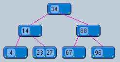 | 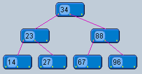 | 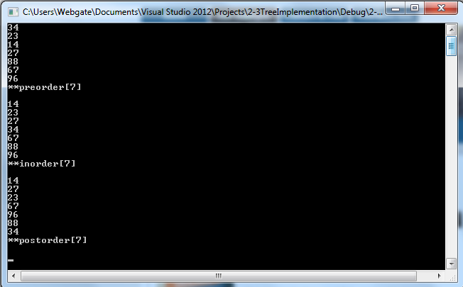 |

#### ➤ Delete 34

| Initial Tree | Resulting Tree | Tree Traversal |
|--------------|----------------|----------------|
| 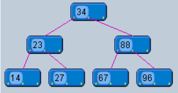 | 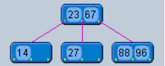 | 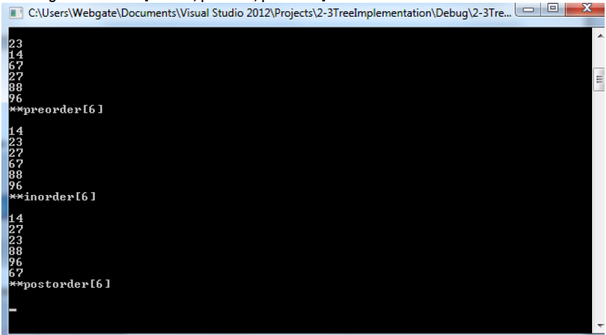 |

#### ➤ Delete 23

| Initial Tree | Resulting Tree | Tree Traversal |
|--------------|----------------|----------------|
| 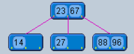 |  | 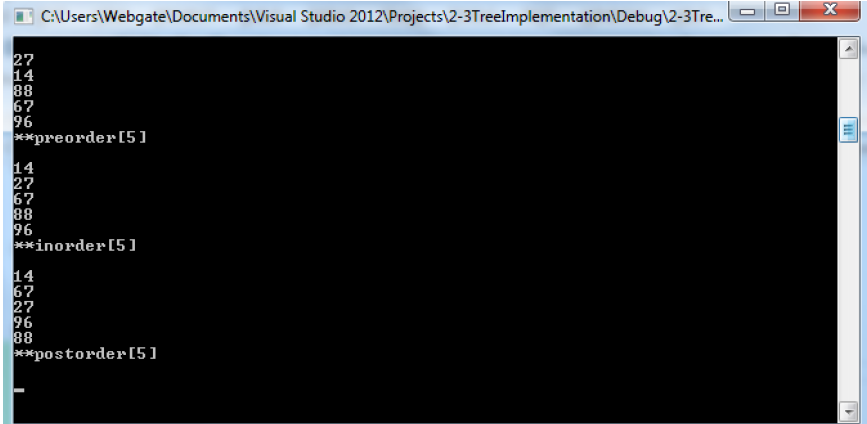 |

#### ➤ Delete 88

| Initial Tree | Resulting Tree | Tree Traversal |
|--------------|----------------|----------------|
| 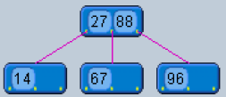 | 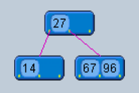 | 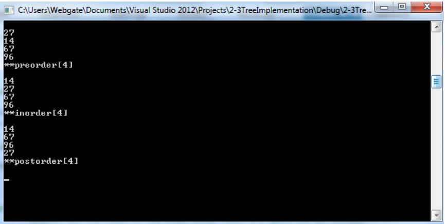 |

#### ➤ Delete 27

| Initial Tree | Resulting Tree | Tree Traversal |
|--------------|----------------|----------------|
| 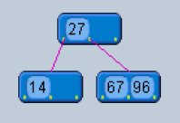 | 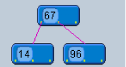 | 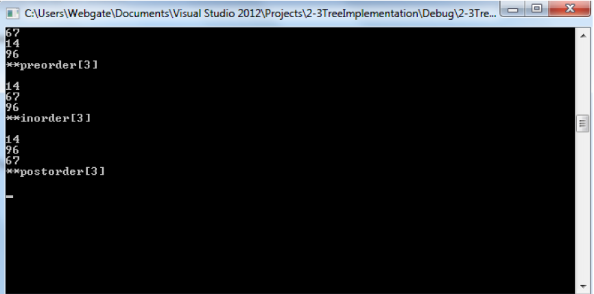 |

#### ➤ Delete 67

| Initial Tree | Resulting Tree | Tree Traversal |
|--------------|----------------|----------------|
| 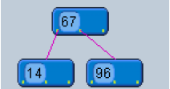 | 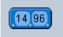 | 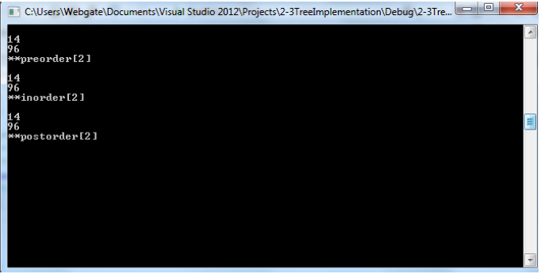 |

#### ➤ Delete 14

| Initial Tree | Resulting Tree | Tree Traversal |
|--------------|----------------|----------------|
| 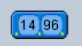 | 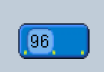 | 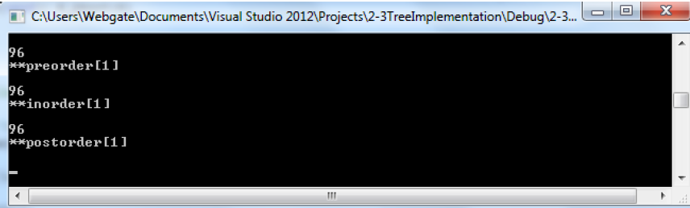 |

> **Note:** Deleting 96 results in an empty tree.

---

