# 🌳 2-3 Tree Deletion Test Cases

This document provides comprehensive test cases for deletion operations in a 2-3 tree, covering local and global rotations, node mergers, internal element removal, and complex restructuring sequences.

## 🔄 Local Rotation

### Testcase 001: Take from right.

**Input Array:** `{67, 34, 23, 88, 96, 14, 4, 27}`

#### ➤ Delete 4

| Initial Tree | Resulting Tree | Tree Traversal |
|--------------|----------------|----------------|
|  |  |  |

#### ➤ Delete 34

| Initial Tree | Resulting Tree | Tree Traversal |
|--------------|----------------|----------------|
|  |  |  |

#### ➤ Delete 23

| Initial Tree | Resulting Tree | Tree Traversal |
|--------------|----------------|----------------|
|  |  |  |

#### ➤ Delete 88

| Initial Tree | Resulting Tree | Tree Traversal |
|--------------|----------------|----------------|
|  |  |  |

#### ➤ Delete 27

| Initial Tree | Resulting Tree | Tree Traversal |
|--------------|----------------|----------------|
|  |  |  |

#### ➤ Delete 67

| Initial Tree | Resulting Tree | Tree Traversal |
|--------------|----------------|----------------|
|  |  |  |

#### ➤ Delete 14

| Initial Tree | Resulting Tree | Tree Traversal |
|--------------|----------------|----------------|
|  |  |  |

> **Note:** Deleting 96 results in an empty tree.

### Testcase 002: Take from middle first.

**Input Array:** `{37, 11, 17, 48, 78, 87, 93, 67, 68, 83}`

#### ➤ Delete 67

| Initial Tree | Resulting Tree | Tree Traversal |
|--------------|----------------|----------------|
| 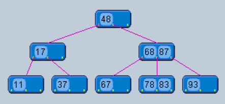 | 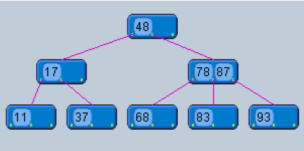 | 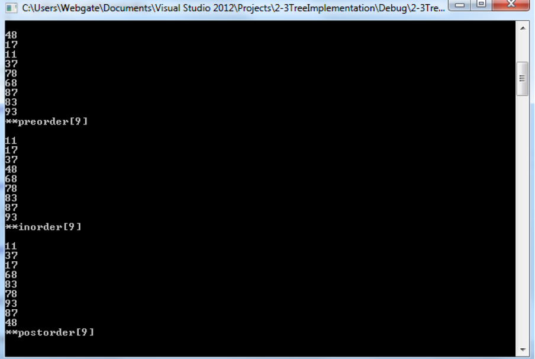 |

### Testcase 003: Take from right.

**Input Array:** `{20, 25, 43, 47, 12, 56, 15, 70, 86, 92}`

#### ➤ Delete 43

| Initial Tree | Resulting Tree | Tree Traversal |
|--------------|----------------|----------------|
| 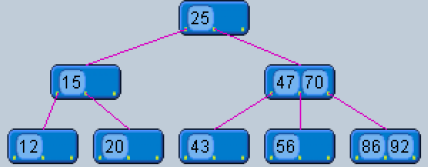 | 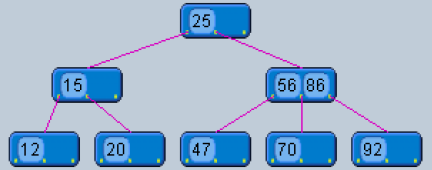 | 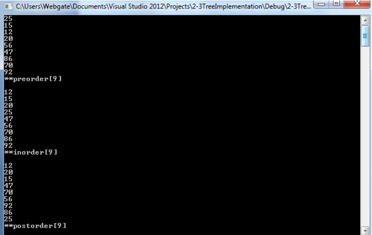 |

---

## 🔁 Global Rotation

### Testcase 004: Take from leftmost child of middle child of the root.

**Input Array:** `{67, 20, 72, 65, 85, 47, 60, 25, 45, 78, 53, 58}`

#### ➤ Delete 45

| Initial Tree | Resulting Tree | Tree Traversal |
|--------------|----------------|----------------|
| 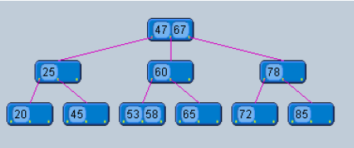 | 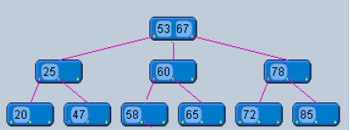 | 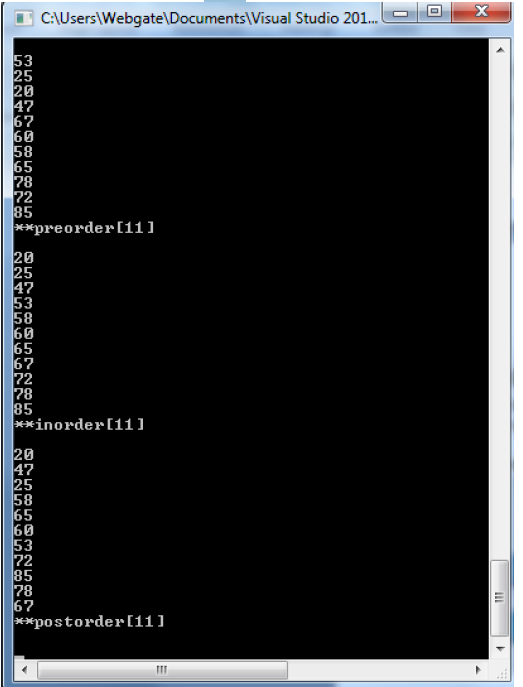 |

### Testcase 005: Take from rightmost child of the left child of the root.

**Input Array:** `{98, 13, 46, 14, 79, 38, 74, 76, 41, 16, 67, 92, 86, 53, 50, 44}`

#### ➤ Delete 50

| Initial Tree | Resulting Tree | Tree Traversal |
|--------------|----------------|----------------|
| 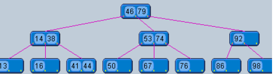 | 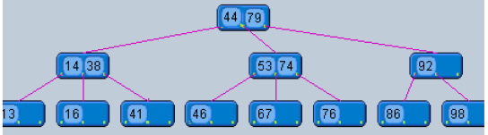 | 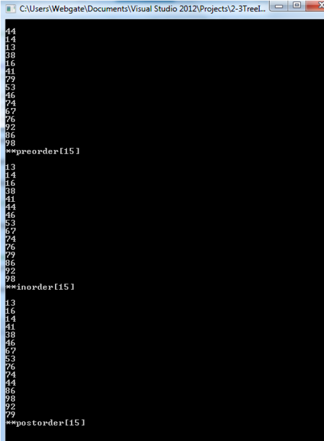 |

---

## 📝 Notes

- Testcases are referenced from the `assets/files/TreeTestCases.pdf` file in the repository
- Each test case demonstrates specific 2-3 tree deletion scenarios and their resulting tree structures
- All tree traversals shown are in the format: [Inorder, Preorder, Postorder]

